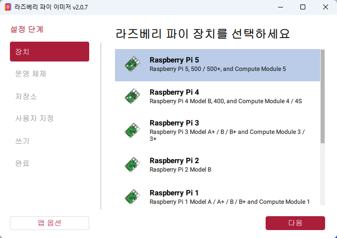
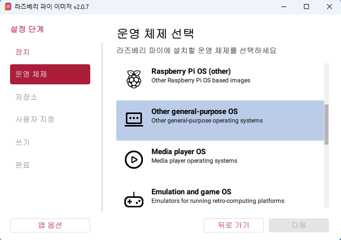
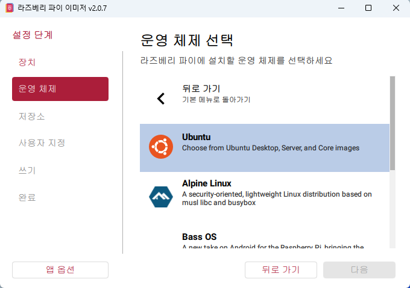
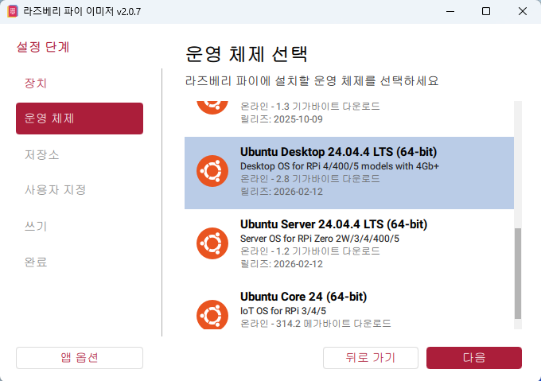
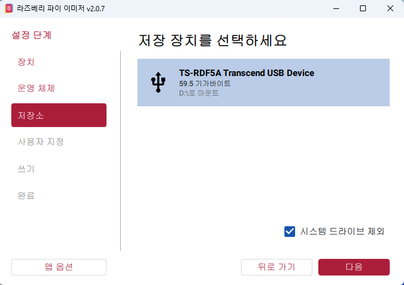
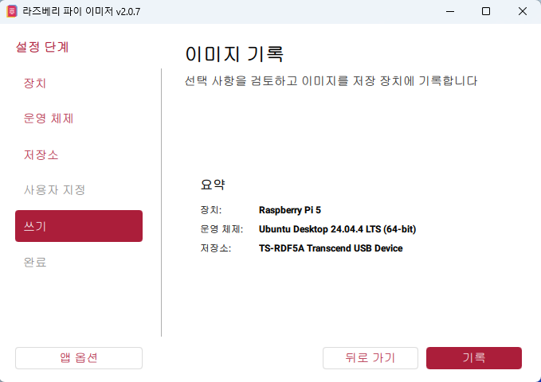
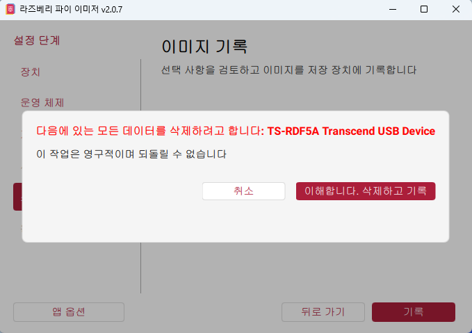

# iot-ros2-2026
IoT 개발자과정 ROS2 기반 Raspberry Pi 학습 리포지토리

## 1일차

### ROS

- `ROS(Robot Operating System)`
	- 운영체제가 아니라 로봇 개발을 위한 오픈소스 미들웨어 플랫폼
	- 로봇 제어, 센서 데이터 처리, 노드 간 통신 등에 특화된 라이브러리 및 도구 제공
	- Ubuntu 환경에서 주로 사용
	- 자율주행, 로봇제어, IoT, 임베디드 시스템 개발 등에 활용

- ROS 구성 개념
	- `Node` : 하나의 기능을 수행하는 실행 단위
	- `Package` : 여러 Node와 코드, 설정파일 등을 관리하는 단위
	- Node에 기능을 구현하고, Package 단위로 관리하면서 서로 `통신`하여 시스템 구성

- ROS 구조 비유
	- ROS : 회사
	- Package : 부서
	- Node : 직원

---

### Ubuntu와 Raspberry Pi OS 원격 접속 방식 차이

- Ubuntu
    - 초기 네트워크 및 계정 설정 과정이 필요하여 최초 1회 모니터 연결 필요
    - 설정 완료 후에는 SSH 및 VNC를 이용한 원격 접속 가능

- Raspberry Pi OS(라즈비안)
    - Wi-Fi 및 SSH를 미리 설정하면 모니터 없이 원격 접속 가능

---

### Raspberry Pi Ubuntu 설치

#### Raspberry Pi Imager를 이용하여 Ubuntu 이미지 설치

1. Raspberry Pi 모델 선택

		

2. 운영체제 종류 선택

	

3. Ubuntu 운영체제 선택

	

4. Ubuntu Desktop 버전 선택

	

5. 이미지 저장 장치 선택

	

6. Ubuntu 이미지 기록 진행

	

7. 저장 장치 기존 데이터 삭제 확인

	

#### Ubuntu 초기 설정 및 SSH 원격 접속

1. 모니터와 연결된 Raspberry Pi를 부팅한 후 Ubuntu 초기 설정 진행

2. 언어(Language)는 영어(English)로 설정

3. 계정 정보 설정
	- User : `rpi`
	- Hostname : `rospi`
	- Password : `ubuntu`

4. 초기 설정 완료 후 터미널 실행

5. SSH 설치 및 서비스 상태 확인

	```bash
	sudo apt update

	sudo apt install openssh-server
		
	systemctl status ssh
	```

6. IP 주소 확인 

	```bash
	ip a
	```

7. Raspberry Pi 연결 해제 후 데스크탑에서 PuTTY를 이용한 SSH 원격 접속
	- 확인한 IP 주소를 이용하여 PuTTY로 접속
	- SSH 서비스를 이용하여 Raspberry Pi에 원격 접속 가능

8. PuTTY 접속 후 다시 패키지 최신화 진행

	```bash
	sudo apt update
	sudo apt upgrade
	```

9. Ubuntu 버전 확인

	```bash
	lsb_release -a
	```

---

### VMware Ubuntu 환경에서 ROS2 Jazzy 설치

#### Ubuntu 패키지 업데이트 

```bash
sudo apt update
sudo apt upgrade
```

- 시스템 패키지 최신화 진행
- 업데이트 완료 후 재부팅 진행


#### ROS2 Jazzy 설치

- [ROS2 Jazzy 공식 설치 문서](https://docs.ros.org/en/jazzy/Installation/Ubuntu-Install-Debs.html)

- 설치 과정

	- Locale 설정 및 UTF-8 환경 구성

		```bash
		locale  # check for UTF-8

		sudo apt update && sudo apt install locales
		sudo locale-gen en_US en_US.UTF-8
		sudo update-locale LC_ALL=en_US.UTF-8 LANG=en_US.UTF-8
		export LANG=en_US.UTF-8

		locale  # verify settings
		```

	- Universe 저장소 활성화

		```bash
		sudo apt install software-properties-common
		sudo add-apt-repository universe
		```

	- ROS2 apt 저장소 추가
		
		```bash
		sudo apt update && sudo apt install curl -y
		export ROS_APT_SOURCE_VERSION=$(curl -s https://api.github.com/repos/ros-infrastructure/ros-apt-source/releases/latest | grep -F "tag_name" | awk -F'"' '{print $4}')
		curl -L -o /tmp/ros2-apt-source.deb "https://github.com/ros-infrastructure/ros-apt-source/releases/download/${ROS_APT_SOURCE_VERSION}/ros2-apt-source_${ROS_APT_SOURCE_VERSION}.$(. /etc/os-release && echo ${UBUNTU_CODENAME:-${VERSION_CODENAME}})_all.deb"
		sudo dpkg -i /tmp/ros2-apt-source.deb
		```

	- ROS 개발 도구 설치

		```bash
		sudo apt update && sudo apt install ros-dev-tools
		```

	- ROS2 Jazzy Desktop 설치

		```bash
		sudo apt install ros-jazzy-desktop
		```

	- ROS2 환경 설정 적용

		```bash
		source /opt/ros/jazzy/setup.bash
		```

---

### Raspberry Pi Ubuntu VNC 원격 접속 설정

#### 1. RealVNC 설치

- PuTTY 접속 후 Downloads 폴더에서 설치 진행

	```bash
	cd Downloads

	wget https://downloads.realvnc.com/download/file/vnc.files/VNC-Server-7.16.0-Linux-ARM64.deb

	chmod u+x VNC-Server-7.16.0-Linux-ARM64.deb

	sudo apt install ./VNC-Server-7.16.0-Linux-ARM64.deb
	```

- `chmod u+x` 적용 후 실행 권한 추가
- `ls` 명령으로 확인 시 파일 색상이 변경됨

#### 2. Wayland 비활성화

- custom.conf 설정 파일 열기

	```bash
	sudo nano /etc/gdm3/custom.conf
	```

- 아래 행의 주석 제거

	```conf
	#WaylandEnable=false
	```

#### 3. Dummy Display 설정

- 패키지 설치

	```bash
	sudo apt install xserver-xorg-video-dummy xinit
	```

- X11 폴더 확인

	```bash
	ls /etc
	```

- xorg.conf 설정 파일 열기

	```bash
	sudo nano /etc/X11/xorg.conf
	```

- 설정 내용 작성

	```conf
	Section "Device"
		Identifier "Configured Video Device"
		Driver "dummy"
	EndSection

	Section "Monitor"
		Identifier "Configured Monitor"
		HorizSync 28-80
		VertRefresh 48-75
		Modeline "1920x1080" 172.80 1920 2040 2248 2576 1080 1081 1084 1118
	EndSection

	Section "Screen"
		Identifier "Default Screen"
		Device "Configured Video Device"
		Monitor "Configured Monitor"
		DefaultDepth 24
		SubSection "Display"
			Depth 24
			Modes "1920x1080"
		EndSubSection
	EndSection
	```

#### 4. VNC 서비스 실행

- VNC 서비스 등록 및 실행

	```bash
	sudo systemctl enable vncserver-x11-serviced.service

	sudo systemctl start vncserver-x11-serviced.service

	sudo systemctl status vncserver-x11-serviced.service
	```

- `running` 상태이면 정상 동작

#### 5. HDMI 설정

- config.txt 설정 파일 열기

	```bash
	sudo nano /boot/firmware/config.txt
	```

- `[all]` 부분에 아래 내용 추가

	```txt
	hdmi_force_hotplug=1
	hdmi_group=2
	hdmi_mode=82
	```

- 설정 완료 후 재부팅 진행

	```bash
	sudo reboot
	```

#### 6. VNC 접속

- VNC Viewer 실행
- PuTTY에서 확인한 IP 주소 입력 후 접속

- 검은 화면 발생 시 아래 명령 실행

	```bash
	sudo systemctl restart gdm3
	```

---

### VMware Ubuntu 환경에서 Python 가상환경 생성

- venvs 폴더 생성 및 Python 가상환경 구성

	```bash
	mkdir -p venvs

	cd venvs

	sudo apt install python3.12-venv

	python3 -m venv --system-site-packages .venv
	```

- 생성 확인

	```bash
	ls -a
	```

- 가상환경 활성화

	```bash
	source .venv/bin/activate
	```

---

### JupyterLab 설치 및 외부 접속 설정

#### 1. JupyterLab 및 ipykernel 설치

	```bash
	python -m pip install --upgrade pip

	python -m pip install ipykernel

	pip3 install jupyterlab
	```

- 설치 완료 후 VMware 재시작 진행

#### 2. JupyterLab 실행

	```bash
	source venvs/.venv/bin/activate

	cd venvs

	jupyter lab
	```

- 실행 시 웹 브라우저에서 JupyterLab 접속 가능

#### 3. JupyterLab 외부 접속 설정

- 설정 파일 생성

	```bash
	jupyter lab --generate-config
	```

- 설정 파일 수정

	```bash
	nano ~/.jupyter/jupyter_lab_config.py
	```

- 설정 내용 추가

	```python
	c.ServerApp.ip = '0.0.0.0'
	c.ServerApp.port = 7890
	c.ServerApp.open_browser = False
	```

#### 4. Windows에서 JupyterLab 접속

- 브라우저에서 접속

	```text
	http://192.168.0.8:7890/
	```

- 토큰 확인

	```bash
	jupyter server list
	```

- 웹브라우저에서 다음 입력
	- Token : 표시된 토큰 번호 입력
	- Password : `ubuntu`